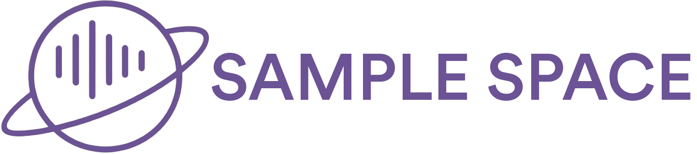

 

  

      
  

<h3 align="center">Sample Space</h3>

**In development**

The service allows users to add audio in the form of samples (excerpts of songs for 15-40 seconds), add them to playlists and leave comments on them.
 
The server part is written in C# + ASP.NET with the DDD architecture. The client part is written in React + TypeScript

### Technologies
- C#
- ASP.NET
- ADO.NET
- PostgreSQL
- Redis
- AWS
- FFmpeg
- TypeScript
- React

### Features
- Custom authentication scheme with access and refresh tokens
- Password recovery
- Audio trimming via FFmpeg (cross-platform)
- Custom audio player

### Contributors
- [oLaDushek](https://github.com/oLaDushek3)

